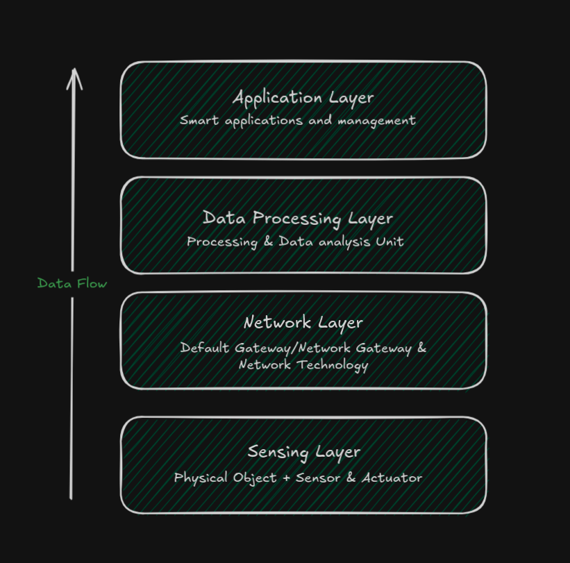

# Internet Of Everything (IoE)

- Refers to the idea to the idea of connecting not just computers, but people, processes, data and objects through the internet. The benefit of IoE comes from the combind effect of linking all these elements together.

## Four Pillar of IoE

_People_: - People in the IoE environment are connected to the internet through smartphones, tablets, computers and fitness trackers.

_Things_: - Refers to physical items such as devices, consumer products, gadgets, enterprise machines or assets implanted with sensors and actuators to communicate across the network.

_Data_: - Each device under IoE generates raw data. Such as data from standalone devices is of no real value. However, when this data is collected from all devices, analyzed, classified and summarized, it becomes processed data.

_Processes_: - Several industries use artifical intelligence, machine learning or IoT-based processes to analyze the data generated by the IoE network. These processes ensure that the correct infromation is relayed to the right destination across the network.

### IoE Examples

- Wearable health devices
- Smart homes
- Smart cities
- SMart retail
- Connected cars

## How does IoE differ from IoT?:

- IoE (Internet Of Everything) is the connection between 4 key elements (the 4 pillars). It is considered as supset of IoT. IoE covers the wider concept of connectivity where network intelligence works as the foundation of IoT. The IoE acts as an extension of IoT
- IoT (Internet of Things) is a network of interconnected physical devices/objects which collect andR exhcange data over wireless networks. It brings the ability of data processing, analytics, decision making to real world physical objects,

